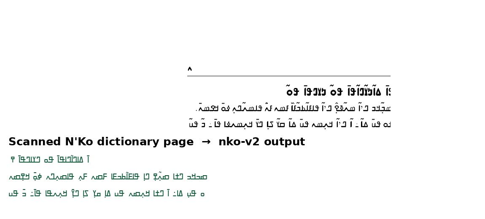

# nko-ocr

Tesseract LSTM models for **N'Ko (ߒߞߏ)** optical character recognition — the writing system of Manding languages (Bambara, Maninka, Dioula), spoken by ~50 million people in West Africa.

**Current release: v2** — CER **6.26%**, WER **17.85%** on a 92-line held-out test set (~94% of characters correct).


*Real output of `nko-v2` on a scanned page of the Baba Diane French–N'Ko dictionary (2014).*

## Why this exists

N'Ko is severely under-represented in digital tools. Before this project:

- the official Tesseract `nko.traineddata` produced **empty output** on N'Ko text;
- no usable N'Ko OCR dataset or model existed anywhere (checked Hugging Face, GitHub, Tesseract tessdata, Oct 2026).

So we built one from scratch: corpus → rendered training images → fine-tuned Tesseract LSTM → evaluated.

## Results

Same 92-line test set for both versions (`lstmeval`):

| Model | CER | WER | Training data |
|-------|-----|-----|---------------|
| v1 (`nko-v1.traineddata`) | 15.84% | 34.84% | 914 pure-N'Ko images, 18k iterations |
| **v2 (`nko-v2.traineddata`)** | **6.26%** | **17.85%** | v1 + 4,000 targeted images (diacritics, N'Ko digits, 2 fonts) + 2,856-word dictionary wordlist, 32k iterations |

v2 divides character errors by 2.5 and word errors by 2 compared to v1.

## Quickstart

```bash
# 1. Grab the model (or use models/ in this repo)
# 2. Run Tesseract (>= 5.0)
tesseract page.png output.txt -l nko-v2 --tessdata-dir ./models

# single text line / column
tesseract line.png stdout -l nko-v2 --tessdata-dir ./models --psm 6
```

Notes:
- Input works best at **≥120 DPI** (renders below that may fail page segmentation — upscale first).
- N'Ko is right-to-left; the model was trained with RTL handling (`LANG_TYPE=RTL`).
- Handwriting is **not** supported — printed text only. Human review is required for critical documents.

## What's in this repo

```
nko-ocr/
├── models/   nko-v2.traineddata (3.3 MB, recommended) · nko-v1.traineddata (3.2 MB)
├── corpus/   corpus-nko.txt — 2,211 N'Ko lines (Bambara, Mali) used for training
│             dictionnaire-nko-wordlist.txt — 2,856-word N'Ko wordlist (Baba Diane dictionary)
├── examples/ ocr_example.sh — minimal end-to-end example
├── docs/     TRAINING.md — how the models were trained (reproducible notes)
└── assets/   demo-before-after.png
```

The full 4,422-image training dataset (358 MB) is too large for git — download it here:
**[NKO-OCR-dataset.zip (Google Drive)](https://drive.google.com/file/d/1O3QuUa40YxuFsoZX4OtOXaGb3cW7R9ub/view)**

Model mirrors: [v2](https://drive.google.com/file/d/1IMZc-d-0mikKjMDrKmgmkS5MRH1KiWQA/view) · [v1](https://drive.google.com/file/d/1x_1g-PzRuJzr1DUFd3Td3s8xezFFnDOC/view)

## Roadmap

- **v3 (planned):** more fonts, image augmentation (noise/rotation/contrast) for robustness on real scans; larger corpus.
- **Handwriting:** out of scope for Tesseract LSTM — would need a TrOCR-style model with a proper N'Ko tokenizer (attempted; base tokenizers don't cover N'Ko).
- **Dictionaries:** the re-OCRed Baba Diane French–N'Ko dictionary (498 pages, ~39,800 entries) feeds future wordlists.

## License

**GPLv3** — see [LICENSE](LICENSE). If you need these models under different terms (e.g. proprietary embedding), contact the author.

## Author & citation

**Fousseyni Diarra** — Bamako, Mali.

```bibtex
@software{diarra2026nkoocr,
  author  = {Fousseyni Diarra},
  title   = {nko-ocr: Tesseract LSTM models for N'Ko script OCR},
  version = {2.0},
  year    = {2026},
  url     = {https://github.com/koussedia/nko-ocr}
}
```

*(_)*

---

## En français

**nko-ocr** — modèles OCR Tesseract pour l'écriture **n'ko (ߒߞߏ)** (bambara/mandingue du Mali).

- **v2 :** 6,26 % d'erreurs caractères, 17,85 % d'erreurs mots (~94 % des caractères corrects).
- Avant ce projet, aucun OCR n'ko utilisable n'existait (le `nko.traineddata` officiel sortait du vide).
- Utilisation : `tesseract page.png sortie.txt -l nko-v2 --tessdata-dir ./models` (images ≥ 120 DPI).
- Texte imprimé uniquement — pas d'écriture manuscrite ; relecture humaine obligatoire pour les documents critiques.
- Licence **GPLv3**. Auteur : **Fousseyni Diarra**, Bamako.
